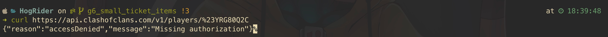
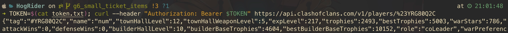

# Clash API Developers - Getting Started

## Table of Content

1. [Clash of Clans API](#1)
    1. [Interacting with CoC API](#1.1)
    2. [Some populate wrappers by language](#1.2)

## Clash of Clans API <a name="1"></a>

Clash of Clans has an official [API](https://developer.clashofclans.com/#/) for querying data about the game. The
endpoints are listed in their documentation [here](https://developer.clashofclans.com/#/documentation). To be able to
query the endpoints you must have a valid HTTP GET request with
a [Bearer Authentication](https://swagger.io/docs/specification/authentication/bearer-authentication/) header containing
the [JSON Web Token](https://jwt.io/introduction) created from within your CoC Dev console.

Keep in mind that the [JSON Web Token](https://jwt.io/introduction) you create from the dev console are tied to the IP
you specify. This means that if your IP changes you will
receive `{"reason":"accessDenied","message":"Invalid authorization"}`

#### Querying without a JWT token



#### Querying with a JWT token



```bash
TOKEN=$(cat token.txt); curl --header "Authorization: Bearer $TOKEN" https://api.clashofclans.com/v1/players/%23YRG80Q2C
```

The above two images showcase what will happen if you skip creating a JWT and attempt to request data from the
CoC API endpoint. You can find more examples on how to manually curl the API on the
[CoC API documentation](https://developer.clashofclans.com/#/documentation) page.

### Interacting with CoC API <a name="1.1"></a>

Interacting with the CoC API endpoints using curl will not get you very far.
You will need to interact with the API using whatever language you have chosen to interact with the API.
The language you pick does not matter. Any modern language that supports sockets will allow you to interact with the
API.
But some languages are better suited for this purpose, especially the ones that already have libraries that
developers have written to interact with the API.

These CoC API libraries, or "wrappers" allow for quicker application creation.
This is because you're not wasting time creating your wrapper.
Another benefit of mature wrappers is the ability to abstract the HTTP get request patterns and model the data
returned into an object that is better suited for the language used.
You can find a list (without guarantee of completeness) [CoC API wrapper](https://coc-libs.vercel.app/)
